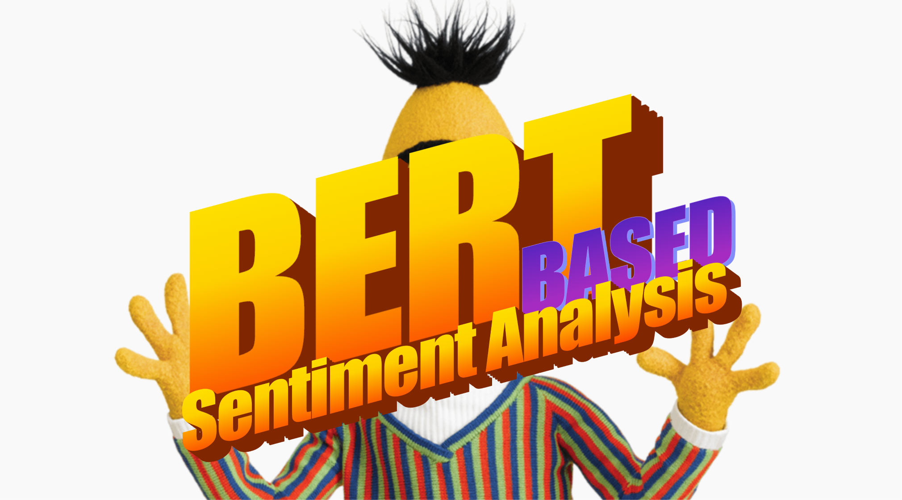
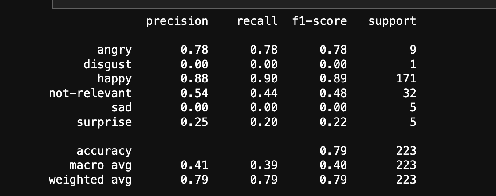

# Sentiment Analysis with BERT
This project applies a pre-trained BERT model to classify sentiment based on a dataset containing various emotion labels. The model is fine-tuned and tested for sentiment analysis, with results presented through common evaluation metrics such as accuracy, precision, recall, and F1-score.

## Project Overview
The goal of this project is to implement a sentiment analysis pipeline using BERT (Bidirectional Encoder Representations from Transformers). BERT is a state-of-the-art transformer model designed to handle NLP tasks with exceptional performance. This project focuses on fine-tuning BERT for multi-class sentiment classification, where the labels represent different emotions such as "happy," "angry," "disgust," etc.

## Key Features
  - __Model__: Fine-tuning BERT for emotion classification.
  - __Data Preprocessing__: Tokenization and input transformation using BERT’s tokenizer.
  - __Evaluation__: Reporting precision, recall, F1-score, and accuracy on test data.
  - __Error Analysis__: Analysis of model performance on various emotion classes, with insights into strengths and areas for improvement.

## Results

### Key Observations
  - The model performs well for classes with larger support, particularly "happy" (F1-score = 0.89) and "angry" (F1-score = 0.78).
  - Performance is significantly weaker for underrepresented classes such as "disgust", "sad", and "surprise", due to the limited number of samples (low support). This highlights the challenge of class imbalance.
  - The overall accuracy is 79%, but the macro average is much lower, indicating the model struggles with minority classes.

## Setup and installation
### Prerequisites
Install the dependencies using:
```bash
pip install -r requirements.txt
```
### Run the notebook
Clone the repo:
```bash
git clone https://github.com/tayheau/BERT_sentiment_analysis.git
cd BERT_sentiment_analysis
```
Open the Jupyter Notebook:
```bash
jupyter notebook
```

## References
[1] : Jacob Devlin et al. *BERT: Pre-training of Deep Bidirectional Transformers for Language Understanding.* 2019. arXiv : [1810.04805 [cs.CL]](https://arxiv.org/abs/1810.04805)

[2] : Bert Documentation [link](https://huggingface.co/docs/transformers/model_doc/bert)
